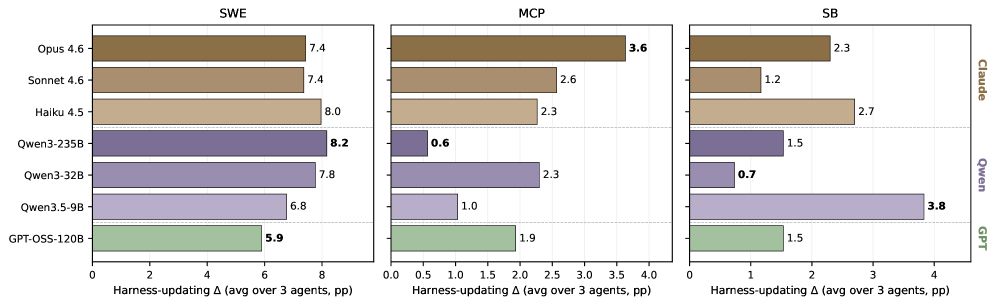
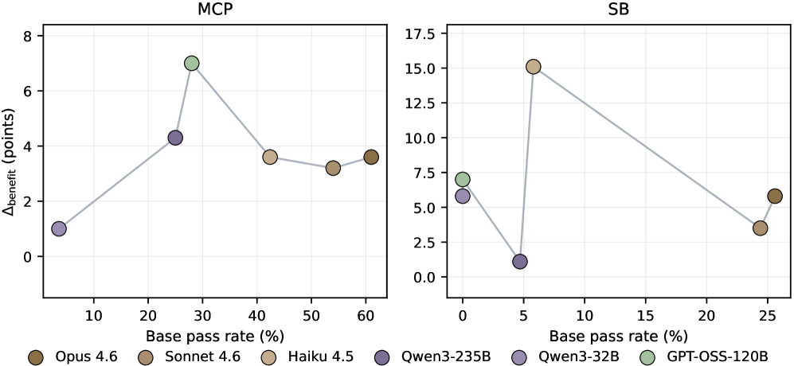
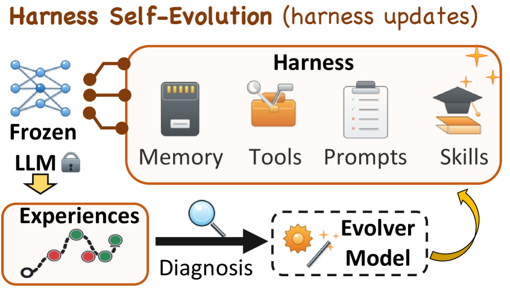
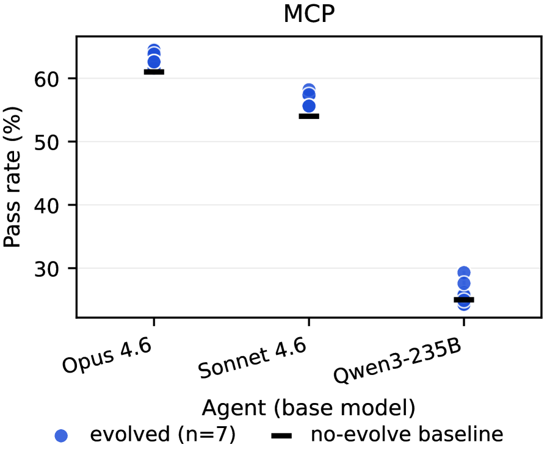
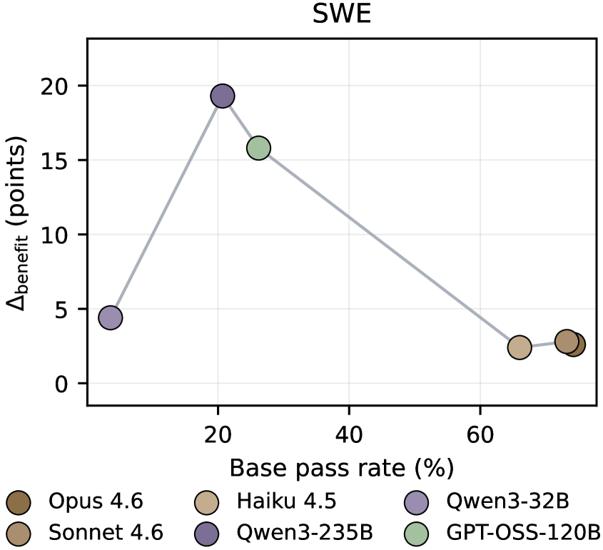

# Harness Updating Is Not Harness Benefit: Disentangling Evolution Capabilities in Self-Evolving LLM Agents

> **TL;DR**: The paper disentangles two capabilities in self-evolving LLM agents: harness-updating (producing effective harness updates) and harness-benefit (gaining performance from updates). Experiments across 7 LLMs and 3 benchmarks show that harness-updating is flat with respect to model base capability, while harness-benefit is non-monotonic—weak models benefit least due to activation and adherence failures. The findings guide investment in agent training for harness invocation and long-horizon instruction following.

| Field | Value |
|-------|-------|
| **Paper** | [arXiv:2605.30621](https://arxiv.org/abs/2605.30621) |
| **HuggingFace** | [Link](https://huggingface.co/papers/2605.30621) |

| **Published** | 2026-05-28 |
| **Authors** | Minhua Lin, Juncheng Wu, Zijun Wang, Zhan Shi, Yisi Sang, Bing He, Zewen Liu, Tianxin Wei, Zongyu Wu, Zhiwei Zhang, Dakuo Wang, Xiang Zhang, Benoit Dumoulin, Cihang Xie, Yuyin Zhou, Suhang Wang, Hanqing Lu |
| **Affiliations** | The Pennsylvania State University, UC Santa Cruz, Amazon, Emory University, UIUC, Northeastern University |
| **Keywords** | self-evolving LLM agents, harness-updating capability, harness-benefit capability, base capability, agent harness, evolver, instruction following, skill loading |
| **Paper Type** | Method · Benchmark · Survey · **Analysis** ✅ · Empirical · Framework · Position · Application |

## Experimental Setup

*Figure 3: Harness-updating capability ($\Delta_{\text{update}}$) of each evolver. Evolvers are grouped by model family (Claude, Qwen, GPT-OSS). The best and worst evolver, marked in bold within each panel, change with the benchmark.*

*Figure 9: $\Delta_{\text{benefit}}$ versus base pass rate on MCP (left) and SB (right) datasets. Each point corresponds to one LLM backbone used as the task-solving agent; points are connected in ascending base pass rate.*

### Datasets
- [SWE-bench Verified](https://arxiv.org/abs/2406.11719): Software engineering benchmark of 500 real-world GitHub issues. Used to evaluate agent's code repair capability.
- [MCP-Atlas](https://scholar.google.com/scholar?q=MCP-Atlas+benchmark): Tool-use benchmark involving multi-server orchestration over 36 MCP servers. Evaluates tool-use competency.
- [SkillsBench](https://scholar.google.com/scholar?q=SkillsBench+benchmark): Skill-based execution benchmark across 11 domains with 86 tasks. Evaluates agent's ability to use harness-provided skills.

## Previous Work & Limitations

### Key Prior Approaches

#### Harness Engineering
- [ReAct](https://arxiv.org/abs/2210.03629) and [Tree of Thoughts](https://arxiv.org/abs/2305.10601) pioneered LLM agents with external reasoning scaffolds.
- Prompt methods: [Zhou et al. 2022](https://arxiv.org/abs/2201.11903), [Pan et al. 2026](https://scholar.google.com/scholar?q=Pan+et+al.+2026+prompts) provide natural-language guidance.
- Tool use: [Hou et al. 2025](https://scholar.google.com/scholar?q=Hou+et+al.+2025+tools), [Qin et al. 2024](https://arxiv.org/abs/2307.16789) expose external APIs with discovery and invocation.
- Memory: [Ouyang et al. 2025](https://scholar.google.com/scholar?q=Ouyang+et+al.+2025+memory), [Xu et al. 2026](https://scholar.google.com/scholar?q=Xu+et+al.+2026+memory) store and retrieve prior observations.
- Skills: [Li et al. 2026b](https://scholar.google.com/scholar?q=Li+et+al.+2026+skills), [Liu et al. 2026](https://scholar.google.com/scholar?q=Liu+et+al.+2026+skills) package reusable procedures as callable modules.
- Code harness: [Ning et al. 2026](https://scholar.google.com/scholar?q=Ning+et+al.+2026+code+harness), [Lee et al. 2026](https://scholar.google.com/scholar?q=Lee+et+al.+2026+code+harness) treat harness as executable code.

#### Self-Evolution of LLM Agents
- Early reflection-based methods: [Reflexion](https://arxiv.org/abs/2303.11366) stores verbal self-reflections; [Self-Refine](https://arxiv.org/abs/2303.17651) iteratively improves outputs via self-feedback; [ExpeL](https://arxiv.org/abs/2308.10144) extracts reusable insights from trajectories.
- Prompt-level evolution: [PromptWizard](https://arxiv.org/abs/2405.15269) refines prompts through critique; [ACE](https://arxiv.org/abs/2410.05869) evolves contextual playbooks; [GEPA](https://scholar.google.com/scholar?q=GEPA+self-evolving+agents) evolves prompts from trajectory-level reflection.
- Memory-level evolution: [EvolveR](https://scholar.google.com/scholar?q=EvolveR+self-evolving+agents) connects offline strategy distillation with online retrieval; [MemEvolve](https://scholar.google.com/scholar?q=MemEvolve+self-evolving+agents) studies meta-evolution of memory systems; [MemMA](https://scholar.google.com/scholar?q=MemMA+self-evolving+agents) improves long-horizon memory through construction and repair.
- Skill-level evolution: [Voyager](https://arxiv.org/abs/2305.16291) accumulates executable skills; [AWM](https://arxiv.org/abs/2406.09357) induces workflows from successful trajectories; [SkillRL](https://scholar.google.com/scholar?q=SkillRL+self-evolving+agents) recursively expands skill libraries; [EvoSkill](https://scholar.google.com/scholar?q=EvoSkill+self-evolving+agents) automates skill discovery.
- Tool-level evolution: agents synthesize or revise tools [Chen et al. 2025](https://scholar.google.com/scholar?q=Chen+et+al.+2025+tool+evolution), [Li et al. 2026a](https://scholar.google.com/scholar?q=Li+et+al.+2026a+tool+evolution).

### Limitations & Gaps
- Prior self-evolution methods report end-to-end improvement but do not disentangle the contributions of the evolver (harness-updating) and the agent (harness-benefit). The gain may stem from either higher-quality updates or better agent utilization, but these are not separately measured.
- No systematic study on how a model's base capability relates to its ability to produce useful harness updates or to benefit from them. Most works evaluate a single agent–evolver pair, so the relationship to base capability remains unknown.
- The potential inefficiency of scaling the evolver model vs. the agent model is unexplored—if harness-updating is not strongly tied to base capability, resources could be better allocated to the agent.

### Related Work Landscape

Research on self-evolving LLM agents centers on prompt evolution, skill libraries, memory mechanisms, and iterative self-improvement, with foundational systems often conflating harness updates (e.g., prompt or tool changes) with genuine capability gains. Key prior works demonstrate non-monotonic performance and automatic curriculum learning but lack explicit disentanglement of evolution capabilities, which recent benchmarks and analyses begin to address through targeted evaluation of self-reflection and skill acquisition.

## Core Analysis & Insights

*Figure 1: Overview of harness self-evolution.*

### Formalization of Harness Self-Evolution
The agent is composed of a frozen model $f$ and an external harness state $H_t$ at evolution step $t$: $A_t = (f, H_t)$. The harness includes prompts, skills, memories, tools.

An evolver $e$ processes execution evidence $\mathcal{D}_t$ and the previous harness $H_{t-1}$ to propose an update $\Delta H_t = e(H_{t-1}, \mathcal{D}_t)$, which is applied to obtain $H_t = \mathrm{Apply}(H_{t-1}, \Delta H_t)$. The evolver is typically an LLM agent.

### Evolution Protocol
1. Start from initial harness $H_0$.
2. For $t = 1, \dots, T$:
   - Agent $A_{t-1}$ attempts tasks $\mathcal{X}_t$, producing trajectories $(\tau_{t,x}, y_{t,x})$.
   - Collect execution evidence $\mathcal{D}_t = \{(x, \tau_{t,x}, y_{t,x}) : x \in \mathcal{X}_t\}$.
   - Evolver produces $H_t = \mathrm{Apply}(H_{t-1}, e(H_{t-1}, \mathcal{D}_t))$.
3. After $T$ steps, final harness $H_T$ is obtained.

### Capability Metrics
- **Base Capability**: $M_{\text{base}}(f) = J_{\mathcal{X}}(f, H_0)$, the agent's performance before evolution.
- **Pairwise Evolution Gain**: $\Delta(f, e) = J_{\mathcal{X}}(f, H_T^{(f,e)}) - M_{\text{base}}(f)$.
- **Harness-Updating Capability**: $\Delta_{\text{update}}(e) = \frac{1}{|\mathcal{F}^{\star}|} \sum_{f \in \mathcal{F}^{\star}} \Delta(f, e)$, mean gain across anchor agents $\mathcal{F}^{\star}$.
- **Harness-Benefit Capability**: $\Delta_{\text{benefit}}(f) = \max_{e \in \mathcal{E}^{\star}} \Delta(f, e)$, maximum gain across anchor evolvers $\mathcal{E}^{\star}$.

These metrics disentangle the two roles and enable testing their relationship to base capability.

### Experimental Setup
Evaluation on three benchmarks: [SWE-bench Verified](https://arxiv.org/abs/2406.11719), [MCP-Atlas](https://scholar.google.com/scholar?q=MCP-Atlas+benchmark), and [SkillsBench](https://scholar.google.com/scholar?q=SkillsBench+benchmark). Seven LLMs: [Claude Opus 4.6](https://www.anthropic.com/claude), [Claude Sonnet 4.6](https://www.anthropic.com/claude), [Claude Haiku 4.5](https://www.anthropic.com/claude), [Qwen3-235B-A22B](https://arxiv.org/abs/2505.17200), [Qwen3-32B](https://arxiv.org/abs/2505.17200), [Qwen3.5-9B](https://scholar.google.com/scholar?q=Qwen3.5-9B), [GPT-OSS-120B](https://scholar.google.com/scholar?q=GPT-OSS-120B). For evolver-side analysis, anchor agents $\mathcal{F}^{\star}$ = {Opus 4.6, Sonnet 4.6, Qwen3-235B}; for agent-side analysis, anchor evolvers $\mathcal{E}^{\star}$ = {Opus 4.6, Sonnet 4.6, Qwen3-235B}. Pass rate is primary metric, evaluated in-situ (tasks scored under pre-update harness). Harness components editable: skills (SWE, SB) and skills+prompts+memory (MCP). Fixed prompt templates across all backbones.

## Evidence & Validation

*Figure 4: Comparison of harness updated by Qwen3.5-9B and Claude Opus 4.6.
We compare an Opus 4.6 agent on the SkillsBench flink-query task under three conditions: no evolved skill (left, score 0.67), a skill evolved by Qwen3.5-9B (center, score 1.0), and a skill evolved by Opus 4.6 (right, score 1.0).
Both evolved skills encode procedurally similar guidance and enable the same agent to solve the task.*

*Figure 5: MCP post-evolution scores: for each anchor agent every blue dot is one of seven evolved scores and the black tick is the no-evolve baseline. Within-agent variation across evolvers is small relative to between-agent variation in base capability.*

*Figure 6: $\Delta_{\mathrm{benefit}}$ versus base pass rate on SWE. Each point is one LLM backbone used as the task-solving agent; points are connected in ascending base pass rate. MCP and SB analogues are in Appendix D.2.*

*Figure 7: Two harness-benefit failure modes for Qwen3-32B on SkillsBench.
Left (threejs): harness activation failure, where an invalid multi-key load action prevents the skill body from entering context.
Right (pg-essay-to-audiobook): harness adherence failure, where the skill is loaded but the agent treats it as a literal script and skips the prescribed fallback chain.*

*Figure 8: Post-evolution scores across evolvers for anchor agents on SWE (left) and SB (right) datasets.
Each anchor task-solving agent is instantiated with a different LLM backbone: Opus 4.6, Sonnet 4.6, or Qwen3-235B.
Blue dots show scores obtained with the seven evolvers, and the black tick marks the no-evolution baseline.*

### Evolver-side Analysis (Harness-Updating)
**Observation 1: Harness-updating is flat in base capability.** Across evolvers, $\Delta_{\text{update}}$ span is at most 3.1 pp on any benchmark. No evolver dominates all benchmarks; e.g., [Qwen3-235B](https://arxiv.org/abs/2505.17200) leads SWE (8.2 pp) but trails MCP (0.6 pp). The smallest model [Qwen3.5-9B](https://scholar.google.com/scholar?q=Qwen3.5-9B) achieves the highest SB gain (3.8 pp), surpassing [Opus 4.6](https://www.anthropic.com/claude) (2.3 pp) and [Qwen3-235B](https://arxiv.org/abs/2505.17200) (1.5 pp).

*Case Study*: On [SkillsBench](https://scholar.google.com/scholar?q=SkillsBench+benchmark) task flink-query, skills evolved by Qwen3.5-9B and Opus 4.6 are procedurally isomorphic (same five-step solution), only surface differences. Both yield perfect score when injected into the same Opus 4.6 agent.

**Observation 2: Post-evolution score dominated by agent's base capability.** Within-agent spread across evolvers is at most 5.1 pp, versus between-agent base-capability gap of up to 36.0 pp. Even the strongest agent with its worst evolver outperforms the weakest agent with its best evolver by 18.6--35.2 pp across benchmarks.

### Agent-side Analysis (Harness-Benefit)
**Observation 1: $\Delta_{\text{benefit}}$ is non-monotonic in base capability.** On SWE, peak at [Qwen3-235B](https://arxiv.org/abs/2505.17200) (19.3 pp), while the weaker [Qwen3-32B](https://arxiv.org/abs/2505.17200) gains only 4.4 pp and the stronger [Opus 4.6](https://www.anthropic.com/claude) gains 2.6 pp. On MCP, peak at [GPT-OSS-120B](https://scholar.google.com/scholar?q=GPT-OSS-120B) (7.0 pp). Ceiling effect explains high-end, but low-end bottleneck is different.

**Observation 2: Weak-tier models fail due to harness activation and adherence failures.**

- *Harness Activation Failure*: Skill-Load Rate (SLR) drops from $\approx 0.96$ for strong models to 0.251 for Qwen3-32B. They often fail to emit a valid standalone `load_skill` action.
- *Harness Adherence Failure*: Harness-Following Rate (HFR) of Qwen3-32B is only 0.142 vs 0.757 for Opus 4.6. Even after loading, weak models do not follow the skill's procedure.
- *Long-horizon drift*: Phase-level adherence scores show Qwen3-32B drops from 0.52 after loading to 0.13 at final validation, while Opus 4.6 stays stable (0.89 to 0.80). GPT-OSS-120B drifts from 0.67 to 0.43.

### Key Takeaways
1. **Allocate capability budget to the task-solving agent, not the evolver.** Harness-updating gains vary little across evolver models; post-evolution performance is determined primarily by the agent's base capability.
2. **Train agents for harness invocation.** Low SLR indicates that weak models need explicit training to reliably load relevant harness artifacts.
3. **Strengthen long-horizon instruction following.** Even after loading, adherence decays drastically for weak models; training must target sustained guidance compliance over long trajectories.

## Critical Analysis

The paper offers a formal decomposition of self-evolution capabilities and provides empirical evidence across multiple models and benchmarks. However, several methodological and interpretive issues weaken the conclusions. The in-situ evaluation on the same task stream used for evolution risks overfitting, making it unclear whether gains reflect genuine improvement or memorization. The claim that harness‑updating is “flat” in base capability is based on small absolute spreads that may be context-dependent, and the reliance on a small anchor set and limited harness editing scope undermines generalizability. The failure analysis is confined to a single benchmark, and the LLM-based adherence metrics lack reliability validation. Finally, the prescriptive takeaways are not empirically tested, and the use of closed-source or non‑standard models limits reproducibility.

- **[HIGH]** The paper uses an **in‑situ evaluation** where the same task stream $\mathcal{X}$ drives both evolution and evaluation. Although each task is scored *before* its own evidence is used for updates, the evolver still sees the entire distribution and can tailor the harness specifically to this set. No out‑of‑distribution or held‑out task set is tested, so the reported gains may reflect overfitting rather than genuine harness improvement. This weakens the external validity of the claimed capabilities.

- **[MEDIUM]** The central claim that **harness‑updating is flat in base capability** is drawn from a maximum spread of only $3.1$ pp across evolvers on any benchmark. For benchmarks where gains are already small (e.g., MCP‑Atlas gains are in the single digits), this spread may be non‑negligible. Moreover, the “flatness” conclusion is sensitive to the choice of anchor agents $\mathcal{F}^{\star}$ (only three strong models) and the specific harness components that can be evolved. A wider set of agents or more complex harness configurations could produce larger variation, limiting the generality of the claim.

- **[MEDIUM]** **Harness‑benefit capability** $\Delta_{\text{benefit}}(f)$ is defined as the *maximum* gain across a fixed set of anchor evolvers $\mathcal{E}^{\star}$. Using the max can inflate the apparent benefit for a particular agent if it happens to pair well with one evolver, and it does not reflect the expected gain a practitioner would obtain when the optimal evolver is not known a priori. A more robust metric (e.g., mean or median gain) would better characterize typical harness‑benefit.

- **[MEDIUM]** The **failure‑mode analysis** (harness activation and adherence failures) is performed only on [SkillsBench](https://scholar.google.com/scholar?q=SkillsBench+benchmark) and not on [SWE‑bench Verified](https://arxiv.org/abs/2406.11719) or [MCP‑Atlas](https://scholar.google.com/scholar?q=MCP-Atlas+benchmark). The underlying mechanisms may differ across task types (code repair vs. tool use vs. diverse skill execution). The conclusion that weak‑tier models suffer from these specific failures is therefore benchmark‑specific and may not generalize.

- **[MEDIUM]** The **Harness‑Following Rate (HFR) and phase‑level adherence** are judged by a single LLM ([Claude Sonnet 4.6](https://www.anthropic.com/claude)) without any reported inter‑annotator agreement, calibration against human judgments, or sensitivity analysis (e.g., varying judge models). This introduces potential bias and undermines the reliability of the adherence metrics.

- **[MEDIUM]** The actionable takeaways—**allocating capability budget to the task‑solving agent, training for harness invocation, and strengthening long‑horizon instruction following**—are presented as prescriptive guidance, but no follow‑up experiment is provided to demonstrate that implementing these suggestions actually improves downstream performance. The paper remains at the level of diagnosis without validating the cure.

- **[MEDIUM]** Several models used in the experiments are **not fully open or reproducible**: [Claude Opus 4.6](https://www.anthropic.com/claude), [Claude Sonnet 4.6](https://www.anthropic.com/claude), and [Claude Haiku 4.5](https://www.anthropic.com/claude) are proprietary; [GPT‑OSS‑120B](https://scholar.google.com/scholar?q=GPT-OSS-120B) appears to be a non‑standard identifier with limited public information. This hinders independent verification and reduces the practical value of the findings for researchers without access to these models.

- **[LOW]** The **case study** on the [SkillsBench](https://scholar.google.com/scholar?q=SkillsBench+benchmark) task flink‑query shows that [Qwen3.5‑9B](https://scholar.google.com/scholar?q=Qwen3.5-9B) and [Opus 4.6](https://www.anthropic.com/claude) produce *procedurally isomorphic* skills based on five high‑level steps. However, only a single example is analyzed, and “isomorphism” is judged at a coarse granularity. The surface differences could matter on tasks requiring exact tool‑call syntax or handling edge cases, so the case does not robustly establish that small models routinely match the procedural content of frontier evolvers.

- **[LOW]** The **evolution protocol uses a fixed prompt template** for all evolvers and agents. It is well‑known that LLM performance can be highly sensitive to prompt wording, and the observed flatness in harness‑updating might partly reflect suboptimal prompt‑model alignment for some backbones rather than an inherent lack of evolver differentiation. No prompt‑engineering iterations are reported.

- **[LOW]** The **anchor sets** $\mathcal{F}^{\star}$ and $\mathcal{E}^{\star}$ each contain only three models. With such small anchor sets, estimates of $\Delta_{\text{update}}(e)$ and $\Delta_{\text{benefit}}(f)$ have high variance, and the choice of anchors could significantly shift the results. No bootstrap error bars or sensitivity analysis is provided.

## Related Papers

- [Reflexion: Language Agents with Verbal Reinforcement Learning](https://arxiv.org/abs/2303.11366) (2303.11366): Introduces verbal self-reflection for iterative agent improvement, serving as a core baseline technique for self-evolving LLM agents that the main paper extends by separating harness updates from capability benefits.

- [Voyager: An Open-Ended Embodied Agent with Large Language Models](https://arxiv.org/abs/2305.16291) (2305.16291): Presents automatic skill library construction and curriculum-driven evolution in an embodied setting, a canonical example where harness updating is not distinguished from performance gains.

- [Generative Agents: Interactive Simulacra of Human Behavior](https://arxiv.org/abs/arXiv:2304.03442) (arXiv:2304.03442): Explores memory-augmented self-evolving agent architectures, highlighting shared challenges in prompt and memory evolution that motivate the disentanglement proposed in the main paper.

- [Self-Refine: Iterative Refinement with Self-Feedback](https://arxiv.org/abs/2310.11511) (2310.11511): Focuses on prompt-based iterative self-improvement for LLM agents, providing an evolution mechanism analyzed by the main paper for non-monotonic capability effects during harness updates.

## Generation Cost

- **Model**: `deepseek-v4-pro` (DeepSeek) — 61335 tokens ($0.034582)

- **Model**: `grok-4.3` (Grok) — 2737 tokens ($0.001893)

- **Total Report Generation Cost**: **$0.036474**

---
*Generated by ppagent on 2026-06-26 00:03 using deepseek-v4-pro*