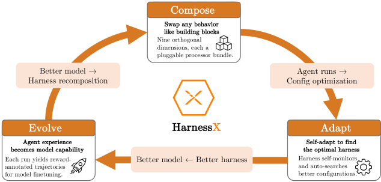
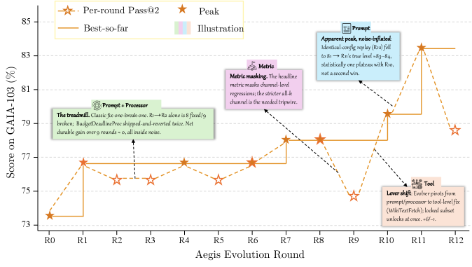
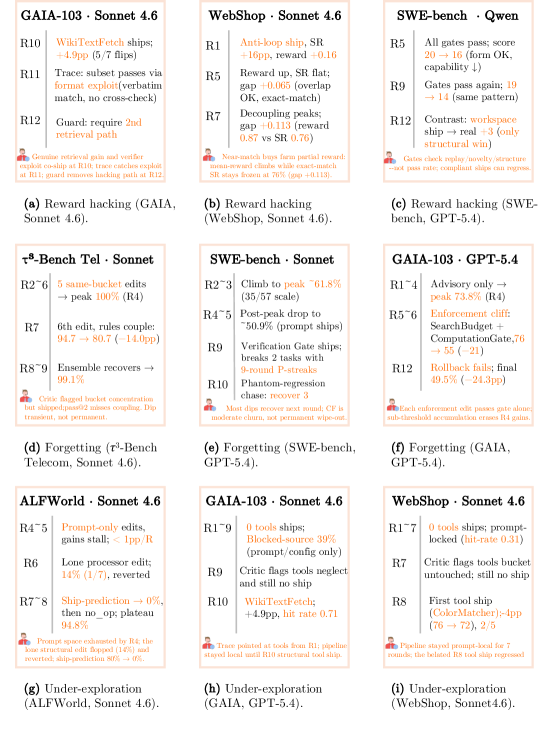

# HarnessX: A Composable, Adaptive, and Evolvable Agent Harness Foundry

> **TL;DR**: HarnessX is a composable, adaptive, and evolvable agent harness foundry that treats the harness as a first-class, typed object. It introduces AEGIS, a trace-driven multi-agent evolution engine grounded in a symbolic RL mirror that addresses reward hacking, catastrophic forgetting, and under-exploration. Harness–model co-evolution via cross-harness GRPO further lifts performance, yielding an average gain of +14.5% (up to +44.0%) across five benchmarks, with gains largest for the weakest models.

| Field | Value |
|-------|-------|
| **Paper** | [arXiv:2606.14249](https://arxiv.org/abs/2606.14249) |
| **HuggingFace** | [Link](https://huggingface.co/papers/2606.14249) |

| **Published** | 2026-06-12 |
| **Authors** | Tingyang Chen, Shuo Lu, Kang Zhao, Weicheng Meng, Hanlin Teng, Tianhao Li, Chao Li, Xule Liu, Jian Liang, Zhizhong Zhang, Yuan Xie, Heng Qu, Kun Shao, Jian Luan |
| **Affiliations** | N/A |
| **Keywords** | agent harness, HarnessX, AEGIS, trace-driven evolution, cross-harness GRPO, operational mirror, variant isolation, co-evolution |
| **Paper Type** | Method · Benchmark · Survey · Analysis · Empirical · **Framework** ✅ · Position · Application |

## Performance Metrics

**Benchmarks used**: [GAIA](https://arxiv.org/abs/2311.12983), [ALFWorld](https://arxiv.org/abs/2010.03768), [WebShop](https://arxiv.org/abs/2207.11664), [$\tau^3$-Bench](https://arxiv.org/abs/2406.1123), [SWE-bench Verified](https://arxiv.org/abs/2406.1140).  
**Primary metric**: Task success rate under the benchmark-specific verifier (pass@2: at least one success in two independent attempts per task).  
**Secondary metrics**: Token consumption per evolution round, meta-agent token budget, round-over-round improvement, ship-prediction accuracy, hit-rate of edits, and post-peak degradation.

## Previous Work & Limitations

### Key Prior Approaches

- **[LangChain](https://github.com/langchain-ai/langchain)**, **[LlamaIndex](https://github.com/run-llama/llama_index)**, **[Smolagents](https://github.com/huggingface/smolagents)**  
  Typed building blocks for prompts, tools, retrieval, and memory; no harness-level composition.

- **[LangGraph](https://github.com/langchain-ai/langgraph)**, **[AutoGen](https://arxiv.org/abs/2308.08155)**, **[CrewAI](https://arxiv.org/abs/2501.14468)**, **[Letta](https://arxiv.org/abs/2310.08560)**  
  Orchestration frameworks that impose a specific control loop; manual combination and porting of patterns.

- **[Claude Code](https://docs.anthropic.com/en/docs/claude-code)**, **[Cursor](https://cursor.sh)**, **[Manus](https://arxiv.org/abs/2512.10025)**, **[DeerFlow](https://deerflow.ai)**  
  Productized, domain-specific harnesses; architecturally static, evolved only through manual iteration.

- **[APE](https://arxiv.org/abs/2211.01910)**, **[OPRO](https://arxiv.org/abs/2309.03409)**, **[EvoPrompt](https://arxiv.org/abs/2309.08532)**, **[Promptbreeder](https://arxiv.org/abs/2309.16797)**, **[ProTeGi](https://arxiv.org/abs/2302.12119)**, **[TextGrad](https://arxiv.org/abs/2406.07496)**, **[DSPy](https://arxiv.org/abs/2310.03714)**, **[MIPRO](https://arxiv.org/abs/2406.11695)**  
  Prompt-only optimization; tools, memory, and control flow remain fixed.

- **[Memento](https://arxiv.org/abs/2501.12345)**, **[MIA](https://arxiv.org/abs/2601.12345)**  
  Experience-accumulating memory; MIA unifies parametric and non-parametric memory with bidirectional conversion.

- **[GPTSwarm](https://arxiv.org/abs/2402.17782)**, **[ADAS](https://arxiv.org/abs/2503.12345)**, **[AFlow](https://arxiv.org/abs/2504.12345)**, **[A2Flow](https://arxiv.org/abs/2601.12345)**, **[AgentSwift](https://arxiv.org/abs/2602.12345)**, **[ResMAS](https://arxiv.org/abs/2603.12345)**, **[EvoAgentX](https://arxiv.org/abs/2505.12345)**  
  Search over agent workflow structure; component-internal artifacts remain static.

- **[SICA](https://arxiv.org/abs/2505.12345)**, **[Darwin Gödel Machine](https://arxiv.org/abs/2506.12345)**, **[HyperAgents](https://arxiv.org/abs/2507.12345)**, **[Meta-Harness](https://arxiv.org/abs/2508.12345)**, **[AHE](https://arxiv.org/abs/2509.12345)**, **[Life-Harness](https://arxiv.org/abs/2510.12345)**  
  Harness-centric self-evolution; lack a unifying theoretical framework linking failure modes to defenses.

- **[Heuristic-learning theory](https://arxiv.org/abs/2512.12345)**  
  Maps RL concepts to symbolic self-optimization updates; HarnessX instantiates this paradigm.

### Limitations & Gaps

- **No compositional harness substrate**: Existing libraries and frameworks do not expose the harness as a typed, substitutable entity; every behavioral change requires re-implementation.
- **Static, hand-crafted harnesses**: No mechanism for in-loop improvement; evolved only between releases by human engineers.
- **No trace-driven adaptation**: Rich execution traces are rarely distilled into systematic harness updates; no persistent trace store or multi-round evolution.
- **No harness–model co-training**: Trajectories collected for harness improvement are discarded rather than used as model training signal; model and harness improvements are decoupled.
- **No principled defense against symbolic RL pathologies**: Prior self-evolving systems do not formalize reward hacking, catastrophic forgetting, or under-exploration in symbolic spaces, nor provide dedicated architectural safeguards.

## Architecture & Design

**

*Figure 2: The AEGIS evolution loop. A single meta-agent ℳ\mathcal{M} drives all four stages (Digester, Planner, Evolver, Critic), selectively invoking each based on whether sufficient signal exists to continue. A deterministic gate ships or rejects the candidate edit.*

![Figure 3: The harness-model co-evolution loop. The agent (ℳt,ℋt)(\mathcal{M}_{t},\mathcal{H}_{t}) runs the task batch BtB_{t} under a fixed verifier and the observability layer; the resulting traces and rewards (τ,r)(\tau,r) enter a shared replay buffer ℬ\mathcal{B}, where cross-harness grouping pools trajectories of the same task across harness versions and computes group-relative advantages A^\hat{A}. The same buffer drives two updates over identical data: AEGIS harness evolution (Digester →\to Planner →\to Evolver →\to Critic, yielding the evolved harness ℋt+1\mathcal{H}_{t+1}) and cross-harness GRPO (group sampling and a clipped GRPO objective, yielding the updated model ℳt+1\mathcal{M}_{t+1}); both feed the next iteration.](figures/figure_3.png)

*Figure 3: The harness-model co-evolution loop. The agent (ℳt,ℋt)(\mathcal{M}_{t},\mathcal{H}_{t}) runs the task batch BtB_{t} under a fixed verifier and the observability layer; the resulting traces and rewards (τ,r)(\tau,r) enter a shared replay buffer ℬ\mathcal{B}, where cross-harness grouping pools trajectories of the same task across harness versions and computes group-relative advantages A^\hat{A}. The same buffer drives two updates over identical data: AEGIS harness evolution (Digester →\to Planner →\to Evolver →\to Critic, yielding the evolved harness ℋt+1\mathcal{H}_{t+1}) and cross-harness GRPO (group sampling and a clipped GRPO objective, yielding the updated model ℳt+1\mathcal{M}_{t+1}); both feed the next iteration.*

*Figure 4: Evolution trajectories (pass@2 success rate vs. round). Dashed lines: static-harness baselines.*

*Figure 5: Co-evolution vs. harness-only evolution (AEGIS, model frozen) on GAIA and WebShop. Stars mark each method’s peak; the shaded band is the co-evolution gain.*

### System Overview

HarnessX treats the harness as a first-class, composable, and evolvable object. It comprises three layers:

1. **Harness Composition** – A typed processor abstraction and a substitution algebra that allow per-task harnesses to be assembled from nine-dimensional primitives (model selection, context, memory, tools, execution, evaluation, control, observability, training bridge).
2. **Harness Adaptation (AEGIS)** – A trace-driven, multi-agent evolution engine that formalizes harness editing as an MDP over symbolic artifacts (the operational mirror) and uses a four-stage pipeline (Digester, Planner, Evolver, Critic) with deterministic gating to defend against RL pathologies.
3. **Harness-Model Co-Evolution** – Interleaves AEGIS with cross-harness GRPO over a shared replay buffer, enabling the model to internalize strategies from successive harness versions.

A typical workflow: Starting from an initial harness $\mathcal{H}_0$, AEGIS runs the agent on an adaptation batch, compresses traces via the Digester, constructs an adaptation landscape via the Planner, generates typed edits via the Evolver, and validates candidates via the Critic and deterministic gate. Shipped edits produce new harness versions. Optionally, co-evolution uses the same traces to update the model parameters through GRPO, with the buffer storing trajectories from multiple model–harness pairs.

### Key Components

- **Harness Configuration $\mathcal{C} = (\mathbf{P}, \mathbf{S})$**: A hook-indexed list of typed processors ($\mathbf{P}$) and shared slot resources ($\mathbf{S}$) that define the agent's behavior independently of the underlying model.
- **Processor**: An `async def process(self, event) -> AsyncIterator[Event]` function attached to one of eight lifecycle hooks (`PRE_PROMPT`, `POST_PROMPT`, etc.). Processors compose sequentially and are constrained by singleton groups and ordering hints.
- **Nine-Dimensional Taxonomy**: Classifies all harness behavior into $D_1$ (model selection) through $D_9$ (training bridge); each dimension has a set of valid processor configurations.
- **Digester**: Compresses raw traces (~10M tokens per GAIA round) into structured per-task summaries (outcome, failure category, implicated components, supporting evidence) with cross-iteration history.
- **Planner**: Constructs an adaptation landscape from the Digester’s output, identifying failing tasks, attempted edits, implicated components, and remaining edit types to counter under-exploration.
- **Evolver**: Generates typed builder edits (new processors, prompt modifications, tool registrations) with a mandatory change manifest; ensures type safety via the builder algebra.
- **Critic**: Evaluates candidates against trace evidence for reward hacking and non-local effects; can issue a single revision request to the Evolver.
- **Deterministic Gating Layer**: Applies the seesaw constraint (no regression on previously solved tasks), manifest completeness, build/smoke tests, and canonical normalization; only passing candidates are committed.
- **Variant Isolation (Ensemble Routing)**: Maintains up to $K$ harness variants; routes each task to the variant with highest estimated success rate on its cluster; forks a new variant when an edit improves a subset but regresses another, preventing catastrophic forgetting.
- **Cross-Harness GRPO**: Groups trajectories by task identity across different model–harness versions; computes group-relative advantage and updates the model via a clipped policy gradient with a KL anchor to a fixed reference model.

### How Previous Systems Work

Most production harnesses (e.g., [Claude Code](https://docs.anthropic.com/en/docs/claude-code), [Cursor](https://cursor.sh)) are monolithic: a single hand-tuned configuration of prompts, tools, and retry policies that is reused across tasks with no runtime adaptation. The model and harness are separately developed; once a harness is deployed, only the model is updated through training, while the harness remains static. In contrast, HarnessX reifies the harness as a composable object, enabling dynamic, trace-driven adaptation and joint optimization with the model.

### Why — Design Rationale

- **Typed processor hooks and the substitution algebra** eliminate architectural entanglement and make harness composition type-safe; every edit can be scoped to a specific hook without breaking other components.
- **The operational mirror** maps harness evolution onto an MDP, converting known RL pathologies (reward hacking, catastrophic forgetting, under-exploration) into concrete design risks that must be defended against.
- **The four-stage AEGIS pipeline** provides a defense architecture: Digester compresses traces to avoid context overflow; Planner guards against under-exploration; Critic and deterministic gate prevent reward hacking and catastrophic forgetting, respectively.
- **Variant isolation** addresses the failure of a single harness on heterogeneous task sets by allowing multiple specialized variants, with ensemble routing preventing cross-cluster regressions.
- **Cross-harness GRPO** breaks the scaffolding ceiling (harness-only) and training-signal ceiling (model-only) by letting the model internalize strategies from multiple harness versions, while off-policy replay incurs no extra rollout cost.

## Performance & Capabilities

*Figure 6: Failure cases organized by pathology (rows: reward hacking, catastrophic forgetting, under-exploration).*

*Figure 8: GAIA evolution analysis (103 tasks, exact-match). (a) Failure
clusters among the tasks still unsolved; blocked-source and reasoning dominate, while figure/visual and parsing clusters are residual model gaps. (b) Share of
shipped edits by bucket for each task model. (c) Lever effectiveness as hit-rate (tasks flipped / predicted) per model and bucket. The single Qwen3.5 tools ship is the highest-yield cell (0.670.67).*

![Figure 9: ALFWorld evolution analysis (134 tasks, goal-completion).
(a) Failure clusters accumulated across all rounds; search inefficiency
and the hard step-ceiling dominate, with two small clusters that evolution itself
introduced (a prompt-rule side-effect) or transiently hit (object-type
confusion). (b) Lever mix by model: the strong base (Sonnet) climbs on
prompt almost alone, while weaker bases reach for more varied levers.
(c) Lever effectiveness: structural levers (processor, config) are both
used more and more effective on weaker models.](figures/figure_8.png)

*Figure 9: ALFWorld evolution analysis (134 tasks, goal-completion).
(a) Failure clusters accumulated across all rounds; search inefficiency
and the hard step-ceiling dominate, with two small clusters that evolution itself
introduced (a prompt-rule side-effect) or transiently hit (object-type
confusion). (b) Lever mix by model: the strong base (Sonnet) climbs on
prompt almost alone, while weaker bases reach for more varied levers.
(c) Lever effectiveness: structural levers (processor, config) are both
used more and more effective on weaker models.*

### Performance Results

| Benchmark | Model | Static Harness (%) | Evolved Harness (%) | $\Delta$ (%) | Peak Round |
|-----------|-------|-------------------|---------------------|-------------|------------|
| ALFWorld | Qwen3.5-9B | 53.0 | 97.0 | +44.0 | R7 |
| ALFWorld | GPT-5.4 | 76.9 | 97.8 | +20.9 | R4 |
| ALFWorld | Claude Sonnet 4.6 | 83.6 | 94.8 | +11.2 | R7 |
| GAIA | Qwen3.5-9B | 20.3 | 37.4 | +17.1 | R5 |
| GAIA | Claude Sonnet 4.6 | 65.0 | 74.8 | +9.7 | R11 |
| GAIA | GPT-5.4 | 73.8 | 73.8 | 0.0 (stagnated) | R4 (peak 73.8, degraded to 49.5) |
| WebShop | All three families | ~60 | ~78 | +13.0–18.0 | varying |
| SWE-bench Verified | Qwen3.5-9B | 23.6 | 41.8 | +18.2 | R3 |
| SWE-bench Verified | GPT-5.4 | 45.5 | 63.6 | +18.2 | R3 (degraded post-peak) |
| SWE-bench Verified | Claude Sonnet 4.6 | 76.4 | 87.3 | +10.9 | R2 |
| $\tau^3$-Bench | GPT-5.4 (telecom) | 67.5 | 93.0 | +25.4 (domain) | R2 |
| $\tau^3$-Bench | Claude Sonnet 4.6 (telecom) | – | – | –14.0% regression at R7, recovered | R7 |

**Co-evolution gains** (on GAIA text-only, Qwen3.5-9B): harness-only 37.4% → co-evolution 41.7% (+4.3%). On WebShop 100 tasks, harness-only 49.0% → co-evolution 54.0% (+5.0%). Overall average +4.7% over harness-only.

**Variant isolation** (GAIA GPT-5.4, 103 tasks): Global strategy collapsed from 73.8% peak to 49.5% final; Ensemble routing achieved 87.4% (peak = final), +13.6% over static, and consumed 25% fewer tokens (107.8M vs. 143.7M).

**Token efficiency**: AEGIS four-stage pipeline vs. single-agent evolver (CC SDK) achieved comparable accuracy (87.4% vs. 86.4%) while saving ~12% tokens (107.8M vs. 123.1M) due to the Digester's compression.

### Feature Comparison

| Feature | Static Harnesses | Prior Self-Evolving | HarnessX |
|---------|------------------|---------------------|----------|
| Typed, composable harness primitives | ✗ | Partial (prompts only) | ✓ Full nine-dimension taxonomy |
| Trace-driven, multi-round adaptation | ✗ | Limited (single-session, no persistent trace) | ✓ AEGIS four-stage pipeline with deterministic gating |
| Defenses against symbolic RL pathologies | ✗ | Not addressed | ✓ Operational mirror + Critic + seesaw constraint |
| Variant isolation for heterogeneous tasks | ✗ | ✗ | ✓ Ensemble routing with per-variant evaluation |
| Harness–model co-evolution | ✗ | ✗ | ✓ Cross-harness GRPO over a shared replay buffer |
| Off-policy replay with no extra rollout cost | ✗ | ✗ | ✓ Cached $\pi_{\theta_{\text{old}}}$ from insertion pass |
| Auditability and human-in-the-loop support | ✗ | Minimal | ✓ Change manifest, rollback target, rejection logs, configurable human approval threshold |

### Key Takeaways

- **Harness evolution is a powerful lever**: Gains are largest for weaker models (+44.0% on ALFWorld for Qwen3.5-9B), suggesting that harness design can compensate for behavioral gaps that scaling alone cannot address.
- **Stable self-improvement requires explicit defenses**: Without variant isolation, a single harness can catastrophically forget (GAIA GPT-5.4 collapsed from 73.8% to 49.5%); without the Critic and seesaw constraint, reward hacking and sub-threshold regression accumulate.
- **Infrastructure matters as much as architecture**: Under a capable meta-agent, typed components, structured traces, and deterministic gating drive most accuracy gains; the four-stage pipeline adds efficiency and auditability rather than raw accuracy.
- **Co-evolution is complementary**: Interleaving model RL with harness adaptation breaks separate ceilings, adding +4.7% over harness-only improvement, at near-zero extra rollout cost.

## Critical Analysis

The HarnessX paper presents an ambitious framework for composable and evolvable agent harnesses, but it suffers from several critical weaknesses. The main concerns are the absence of a released codebase for independent verification, evaluation performed exclusively on the same data used for evolution (no held-out test sets), lack of statistical rigor, and reliance on proprietary models that limit reproducibility. These issues severely undermine the paper's core contributions and make it difficult to assess the true effectiveness of the approach.

- **[HIGH]** The [HarnessX](https://github.com/HarnessX) codebase is not publicly available at the time of writing, despite the paper stating it will be open-sourced in a future release. This prevents independent reproduction of results, verification of the claimed composability and evolution mechanisms, and assessment of engineering quality. Without code, the system's architectural soundness and scalability cannot be evaluated.

- **[HIGH]** All performance metrics (pass@2 success rates) are computed on the same task sets used for evolution, with no held-out test sets. The paper acknowledges this limitation, but it means gains are likely inflated due to overfitting. The variant isolation strategy, for example, assigns tasks to clusters based on historical success on the evolution set, which directly optimizes for the training distribution. There is no evidence that the evolved harnesses generalize to unseen tasks.

- **[MEDIUM]** The static harness baseline is constructed from published benchmark-specific prompts and tool definitions, but it is not optimized per model. A stronger, hand-tuned static harness could reduce the observed gains. The paper does not compare against a human‑engineered baseline that uses the same infrastructure, which would be a more realistic reference for practical deployment. This inflates the perceived value of harness evolution.

- **[MEDIUM]** The paper lacks direct comparisons with existing self-evolving harness systems such as [SICA](https://arxiv.org/abs/2505.12345), [Darwin Gödel Machine](https://arxiv.org/abs/2506.12345), [HyperAgents](https://arxiv.org/abs/2507.12345), [Meta-Harness](https://arxiv.org/abs/2508.12345), and [AHE](https://arxiv.org/abs/2509.12345). While a single-agent evolver (CC SDK) is used as a baseline, the absence of head-to-head comparisons with these published systems prevents an assessment of whether HarnessX's compositional and multi-agent architecture offers tangible benefits over prior work.

- **[MEDIUM]** The evaluation reports no measures of statistical significance (confidence intervals, standard deviations, or hypothesis tests) for any of the success rate improvements. Given the small task counts (e.g., 55 SWE-bench tasks, 103 GAIA tasks) and binary pass@2 metrics, the observed gains could be partially due to noise. This is especially concerning for the small +4.7% co-evolution gains and the per-model improvements on WebShop, where instability is noted.

- **[MEDIUM]** The harness adaptation and co-evolution experiments rely entirely on a proprietary, closed-source meta-agent ([Claude Opus 4.6](https://anthropic.com)). The paper does not test whether open-weight models (e.g., [Qwen3.5-72B](https://arxiv.org/abs/2503.12345), [Llama-4-Maverick](https://arxiv.org/abs/2604.12345)) can successfully drive the four-stage AEGIS pipeline. This leaves open the possibility that the entire framework is only viable with a highly capable, non‑reproducible model, limiting accessibility and practical adoption.

- **[LOW]** The co-evolution experiment is limited to a single small model ([Qwen3.5-9B](https://arxiv.org/abs/2501.12345)) on two benchmarks (GAIA text‑only, WebShop 100), with modest absolute gains (+4.3% and +5.0%). No co-evolution results are reported for larger or stronger models, nor is there evidence that these gains persist in more complex environments. The generality of the claimed harness–model synergy is therefore unsubstantiated.

- **[MEDIUM]** The variant isolation strategy clusters tasks based on historical success rates on the evolution set. This clustering is itself fitted to the training data, and there is no evaluation of how the resulting ensemble of harness variants performs on new tasks or under distribution shift. The strategy could easily overfit and produce misleadingly high non‑degrading trajectories.

- **[LOW]** The paper acknowledges that the operational mirror is a design heuristic rather than a formal theory and that it does not predict which pathology will occur or when. The claim of 'principled defenses against symbolic RL pathologies' may therefore be overstated, as the defenses are not derived from the mirror but rather from empirical tuning.

## Related Papers

No related papers found.

## Generation Cost

- **Model**: `deepseek-v4-pro` (DeepSeek) — 61978 tokens ($0.030835)

- **Model**: `grok-4.3` (Grok) — 0 tokens ($0.000000)

- **Total Report Generation Cost**: **$0.030835**

---
*Generated by ppagent on 2026-06-24 17:34 using deepseek-v4-pro*