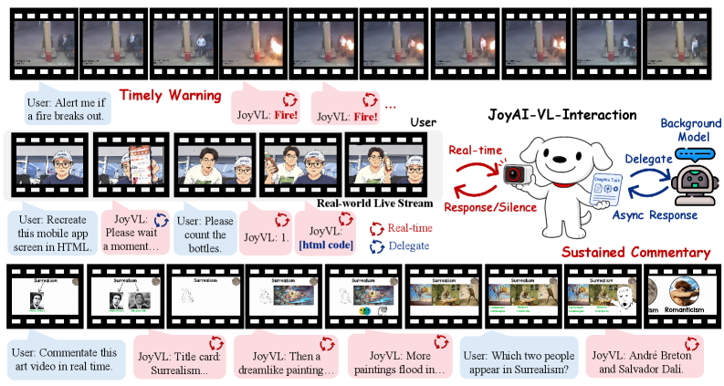
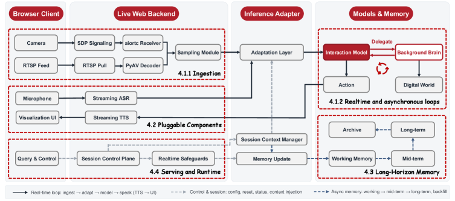

# JoyAI-VL-Interaction: Real-Time Vision-Language Interaction Intelligence

> **TL;DR**: JoyAI-VL-Interaction is an open-source 8B vision-language interaction model that proactively decides when to speak, stay silent, or delegate tasks based on a continuous video stream. It is paired with a complete deployable system enabling real-time streaming interaction. Human evaluators prefer it over Doubao (77.6% win rate) and Gemini (87.9% win rate) on time-critical vision-driven tasks.

| Field | Value |
|-------|-------|
| **Paper** | [arXiv:2606.14777](https://arxiv.org/abs/2606.14777) |
| **HuggingFace** | [Link](https://huggingface.co/papers/2606.14777) |
| **Code** | [GitHub](https://github.com/jd-opensource/JoyAI-VL-Interaction) |

| **Blog** | [Web](https://joyai-vl-video-future-academy-jd.github.io/JoyAI-VL-Interaction/) |

| **Published** | 2026-06-10 |
| **Authors** | Dingyu Yao, Junhao Zhou, Chenxu Yang, Chuanyu Qin, Haowen Hou, Zheming Liang, Congcong Wang, Yuhang Cao, Shenglong Ye, Shuai Xie, Shuhuan Gu, Haoyang Huang, Qingyi Si, Nan Duan, Jiaqi Wang |
| **Affiliations** | JD.com |
| **Keywords** | interaction model, streaming video, proactive response, delegation, AdaCodec, time awareness, long-horizon memory, VL-interaction |
| **Paper Type** | **Method** ✅ · Benchmark · Survey · Analysis · Empirical · Framework · Position · Application |

## Benchmarks

The model is evaluated on six human-rated real-world streaming scenarios comprising 58 cases, compared against Doubao and Gemini in-app video-call assistants. Scenarios include monitoring/alerting, real-time counting, translation, time awareness, commentary/guidance, and long-horizon memory.

## Previous Work & Limitations

### Key Prior Approaches
- **[GPT-Realtime-2](https://platform.openai.com/docs/guides/realtime)**: Real-time speech-to-speech model optimized for conversational turn-taking; waits for user utterance.
- **[Qwen3.5-Omni](https://arxiv.org/abs/2505.01267)**: Natively pretrained omni-modal model with streaming, but dialogue‑centric, not event‑driven.
- **[Doubao In-App Video Call](https://www.bytedance.com/en/doubao)**: Consumer assistant using ASR/VLM/TTS with periodic background polling to simulate proactivity.
- **[Gemini In-App Video Call](https://gemini.google.com/)**: Turn‑based video‑call assistant answering only when prompted; no continuous monitoring.
- **[TML Interaction Model](https://www.thinkingmachinesab.com/)**: 276B MoE model fusing audio and video for proactive interaction; research preview, not open‑source.
- **[MoshiRAG](https://arxiv.org/abs/2503.02741)**: Open full‑duplex speech model, speech‑centric and not visual event‑driven.
- **[Streaming Video LLMs](https://arxiv.org/search/?query=streaming+video+understanding)**: Many works advance one dimension (responsiveness, proactivity, memory) but rarely all three together.
- **[AdaCodec](https://arxiv.org/abs/2503.11632)**: Predictive visual codec encoding only motion/residuals for efficient video tokenization.
- **[Qwen3-8B](https://arxiv.org/abs/2505.13503)**, **[Qwen3-VL ViT](https://arxiv.org/abs/2504.14058)**: Base language model and vision encoder.
- **[On-Policy Distillation](https://arxiv.org/abs/2406.12060)**, **[RL](https://arxiv.org/abs/2203.02155)**, **[EasyVideoR1](https://github.com/Tongyi-Easy/EasyR1)**: Training infrastructure.

### Limitations & Gaps
- Turn‑based models cannot react to unprompted visual events; they lack a mechanism for continuous monitoring.
- Real‑time omni models remain dialogue‑centric and wait for user turns.
- Consumer video‑call products rely on external polling or pure turn‑taking, so reaction delay is bounded by polling interval or user input.
- Streaming video research typically addresses only one axis (e.g., responsiveness) and lacks full system integration for long‑horizon, proactive, real‑time operation.
- Prior interaction model ([TML](https://www.thinkingmachinesab.com/)) is not open‑source and uses a much larger model.
- No previous system combines vision‑driven proactivity, delegation, long‑horizon memory, and a deployable real‑time stack.

### Related Work Landscape

The research domain of real-time, proactive vision-language models (VLMs) has rapidly emerged around 2025, shifting focus from offline, turn-based video understanding to causal/streaming architectures that process live video feeds continuously. Core challenges include low-latency frame-by-frame processing, long-context memory management under streaming constraints, and autonomous decision-making about when to respond, remain silent, or delegate tasks. Foundational efforts include Dispider, which disentangles perception/decision/reaction modules, VideoLLM Knows When to Speak with its video-text duet formats, the TGLG benchmark with VLM-TSI baseline for timing-aware evaluation, and HRIBench for latency trade-offs. More recent frameworks such as StreamBridge (decayed memory buffers and decoupled activation), ESTP (egocentric dynamic compression), StreamMind, and ROMA advance memory-efficient proactivity, while JoyAI-VL-Interaction stands out as the first fully open-source system that internalizes silence/response/delegate decisions at every second, achieving strong human preference wins and emergent capabilities.

## Method

*Figure 1: JoyAI-VL-Interaction processes a continuous video stream in real time, deciding at each step whether to respond, stay silent, or delegate complex tasks to a background model for asynchronous handling.*

![Figure 2: Model overview and video encoding with AdaCodec [9].](figures/figure_2.png)

*Figure 2: Model overview and video encoding with AdaCodec [9].*

*Figure 3: Overview of the JoyAI-VL-Interaction System.*

### What It Does
1. **Continuous observation**: The model receives a video stream at 1 Hz, encoded with [AdaCodec](https://arxiv.org/abs/2503.11632) (reference frames + compact P‑tokens).
2. **Per‑second decisions**: At each step, the model emits one of three actions:
   - `</silence>`: stay silent and keep watching.
   - `</response>`: speak a text reply (rendered via pluggable TTS).
   - `delegate`: emit a hidden query to an asynchronous background brain; the result is later folded back while the model stays present.
3. **Training data**: >4M time‑aligned clips built via a multi‑stage pipeline with verifier agents, covering alerting, QA (backward/present/forward), counting, commentary, chat, and delegation episodes. Each clip provides per‑second supervision (silence/response/delegate).
4. **Weighted SFT loss**: To counter silence dominance, the loss assigns `$w_{\text{silence}}^{\text{repeated}}=0.4$`, `$w_{\text{response}}=1.5$`, while other tokens weight 1.
5. **RL stage (GRPO)**: Stream‑level rewards optimize timing (correct window, no false alarms, proper delegation), using answer‑centered window sampling to keep rollouts tractable.
6. **Architecture**: Base [JoyAI-VL 1.0](https://arxiv.org/abs/2504.14058) (LLM: [Qwen3-8B](https://arxiv.org/abs/2505.13503), vision encoder: [Qwen3-VL ViT](https://arxiv.org/abs/2504.14058), projection) fine‑tuned with interaction data.
7. **System**: Two concurrent loops – real‑time interaction loop and asynchronous delegation loop. Long‑horizon hierarchical memory (short‑term raw tokens, mid‑term text summaries, long‑term compressed blocks) enables prefix reuse on vLLM for sub‑second latency over hours. ASR, TTS, and UI are pluggable.

### How Previous Methods Work
- **Turn‑based models**: Wait for user query, process a single snapshot or clip, respond. No continuous observation and no self‑initiated action.
- **[Doubao](https://www.bytedance.com/en/doubao)**: In video‑call mode, caches incoming frames when silent; a periodic `ExternalTextToLLM` trigger fires every few seconds to obtain analysis, so reaction latency is at least one polling cycle.
- **[Gemini](https://gemini.google.com/)**: Answers only at the moment a user asks; no background monitoring.
- **[TML Interaction Model](https://www.thinkingmachinesab.com/)**: Fuses audio and video into a large MoE model; attempts proactive response but the model is not open‑source and uses a much larger parameter count.

### Why — Motivation & Design Rationale
- **Learned per‑second decision**: Decoupling the “when to act” from external triggers or user turns removes polling delays and allows reaction bounded only by inference time; essential for safety‑critical alerting.
- **Weighted loss**: Without it, the overwhelming majority of silence steps push the model toward perpetual silence; the weighting ensures response and delegation signals are not diluted.
- **RL on stream‑level rewards**: Token‑level SFT cannot capture the nuanced timing of a response (e.g., a reply one second late is penalized differently from a correct‑time reply); RL directly optimises the end‑to‑end interaction behavior.
- **Delegation protocol**: Allows an 8B model to handle hard problems (math, video reasoning) by offloading them to a larger background model without freezing the real‑time loop; the model stays present and can field new turns while waiting.
- **AdaCodec**: Streaming a video second‑by‑second with full per‑frame ViT tokens would inflate cost and latency; AdaCodec reduces predictable frames to ~16 tokens, keeping per‑step work small and proportional to scene change frequency.
- **Hierarchical memory + vLLM prefix reuse**: Storing text summaries of past chunks allows the engine to prefetch a fixed KV‑cache prefix and only compute the newest frames, enabling sustained sub‑second latency over hours.
- **Pluggable I/O**: Keeping ASR/TTS outside the model decouples the autonomous vision‑driven interaction core from speech modality choices, making the system adaptable to different languages and deployment preferences.

## Performance Evaluation

### Main Results
Human evaluation on six streaming scenarios (58 cases) against [Doubao](https://www.bytedance.com/en/doubao) and [Gemini](https://gemini.google.com/) in‑app video‑call assistants.

**Overall win rates**:
- JoyAI-VL‑Interaction vs Doubao: **77.6%** win, 17.2% tie, 5.2% loss.
- JoyAI-VL‑Interaction vs Gemini: **87.9%** win, 10.3% tie, 1.7% loss.

| Scenario | vs Doubao win rate | vs Gemini win rate |
|----------|--------------------|---------------------|
| Monitoring & alerting | 100% | 100% |
| Real‑time counting | 70% | 100% |
| Real‑time translation | 80% | 100% |
| Time awareness | (not explicitly reported, but competitive) | 50% (Gemini ties 40%, wins 10%) |
| Live commentary & guidance | 55.6% | 100% |
| Long‑horizon memory | 77.8% | 77.8% |

Largest margin appears on time‑critical tasks (monitoring, counting, translation), where turn‑based baselines structurally miss events or arrive late.

### Ablation Studies
The paper does not report formal ablation experiments but discusses the importance of several design choices:
- **Weighted SFT loss**: Prevents the silence‑dominated gradient from suppressing response and delegation actions.
- **RL stage**: Improves timing precision; without it the model would speak at inappropriate moments or miss critical events.
- **Long‑horizon memory**: Without the hierarchical memory, the model would forget events after a few hundred seconds; the memory allows answering questions about events far earlier in the stream.
- **AdaCodec**: Without it, token cost would grow linearly with stream length, making real‑time deployment on long streams infeasible.
- **Delegation protocol**: Removing delegation would force the small model to either answer complex questions poorly or block the interaction loop while processing them.
- **Pluggable ASR/TTS**: Decoupling speech I/O from the model preserves the vision‑first reactive capability and allows easy adaptation to different speech engines.

### Key Takeaways
- An interaction model that internally decides when to act outperforms mature turn‑based products on vision‑driven, time‑critical tasks, even with far fewer parameters.
- Delegation enables a compact 8B model to leverage larger background models asynchronously, combining real‑time presence with heavy reasoning on demand.
- Open‑sourcing the model, training recipe, data, and full deployable system lowers the barrier for the community to explore and build real‑world streaming interaction.

## Critical Analysis

The paper introduces JoyAI-VL-Interaction, an 8B vision-first model that proactively decides when to speak, stay silent, or delegate. While the system integration is impressive, the experimental validation is small-scale and lacks formal ablations. The comparisons against Doubao and Gemini are misleading due to built-in product limitations (auto-hangup, no delegation) that inflate win rates. Reproducibility is contingent on a future release date. Ethical risks from continuous monitoring are not addressed.

- **[MEDIUM]** No formal ablation studies are presented to isolate the contributions of weighted SFT loss, RL, long-horizon memory, AdaCodec, or delegation. The paper only discusses their importance qualitatively, making it impossible to assess the marginal benefit of each component.

- **[MEDIUM]** The RL training uses 'answer-centered window sampling' to compress rollouts, but the details are vague and may bias the policy toward pre-identified answer windows, potentially failing on open-ended streams without a 'gold' window.

- **[MEDIUM]** The training data relies heavily on synthetic pipelines (e.g., VLM‑generated multi-turn chat, rule‑based counting). Artifacts from these pipelines may lead to unrealistic interaction patterns and limit robustness on authentic, noisy real-world streams.

- **[LOW]** The weighted SFT loss hyperparameters (wsilence_repeated=0.4, wresponse=1.5) are chosen without reporting any tuning or validation, reducing confidence in their optimality.

- **[HIGH]** The paper does not address the concurrency problem: while the model is generating a long textual response (after emitting </response>), it may miss new visual input, contradicting the claimed continuous observation. The system design does not describe how ingestion and generation are interleaved.

- **[MEDIUM]** The model relies on pluggable ASR for speech input, but the paper contains no analysis of robustness to ASR errors or latency, which can significantly impact real-time interaction decisions.

- **[MEDIUM]** The RL reward function is described only at a high level (crediting correct timing, penalizing false alarms); insufficient detail is provided to reproduce the RL stage or verify its effectiveness.

- **[MEDIUM]** Baselines are limited to two closed commercial products (Doubao, Gemini). No comparison is made against any open-source streaming-video LLM or proactive interaction model, weakening claims of superiority within the research community.

- **[HIGH]** The human evaluation uses only 58 cases across six scenarios, with no statistical significance tests, confidence intervals, or effect sizes reported, undermining the strong claim of large win‑rate margins.

- **[HIGH]** Comparisons are structurally unfair: Doubao and Gemini are not designed for continuous monitoring and have session timeouts (5 min and ~2:15 min), directly causing 'losses' in long‑horizon memory cases. Delegation tasks are also impossible for the baselines, inflating JoyAI-VL-Interaction’s win rate.

- **[LOW]** Inter‑rater reliability metrics (e.g., Cohen’s κ) are not reported despite the use of five raters, making the agreement claim ('high') unverifiable.

- **[MEDIUM]** The evaluation metric converts ordinal ratings (good/fair/poor) to numeric scores and averages them across two axes, then uses these averages to declare win/tie/loss. This coarse quantization discards nuance and may not reflect true user preference.

- **[MEDIUM]** Emergent capabilities (shopping guidance, slide lecture) are illustrated with cherry‑picked case studies without any controlled quantitative evaluation, so the claim of generalisation remains anecdotal.

- **[MEDIUM]** The paper does not discuss information loss in the hierarchical memory system; text‑based summaries may omit crucial visual details, and no analysis is given on how performance degrades over hours of streaming beyond the claimed two‑hour window.

- **[MEDIUM]** The model is evaluated only on short, curated scenarios that may not represent long‑term, noisy, or unstructured real‑world deployments, limiting the generality of the conclusions.

- **[HIGH]** All code, data, and model weights are promised to be released by June 20, 2026, which is after the paper’s submission. At the time of review, the work is not independently reproducible, and no verification of the release is possible.

- **[MEDIUM]** Critical details of the data construction pipeline (e.g., verifier agents, multi‑role agent orchestration) are not fully disclosed, hindering exact reproduction of the training corpus.

- **[HIGH]** The paper does not address the ethical and societal risks of deploying a model that continuously watches a live camera feed, such as privacy violations, mass surveillance, or stalking, nor does it propose safeguards.

- **[MEDIUM]** The delegation protocol enables the system to call external APIs or agents; no discussion is given about the risks of malicious instructions or unintended autonomous actions being carried out via this bridge.

## Related Papers

- [Dispider: Enabling Video LLMs with Active Real-Time Interaction via Disentangled Perception, Decision, and Reaction](https://arxiv.org/abs/Dispider) (Dispider): Dispider's disentangled perception-decision-reaction architecture directly informs JoyAI-VL-Interaction’s internal decision module for autonomous silence vs. response choices in live streams.

- [Temporally-Grounded Language Generation: A Benchmark for Real-Time Vision-Language Models](https://arxiv.org/abs/2505.11326) (2505.11326): TGLG benchmark and its VLM-TSI baseline supply the timing-aware (TRACE) evaluation methodology that JoyAI-VL-Interaction adopts to measure proactive responsiveness beyond accuracy metrics.

- [StreamBridge: Turning Offline Video-LLMs into Proactive Streaming Assistants](https://arxiv.org/abs/StreamBridge) (StreamBridge): StreamBridge's decayed memory buffers and decoupled activation models serve as the direct architectural precursor to JoyAI-VL-Interaction’s memory-efficient always-on streaming pipeline.

- [ESTP: Ego Streaming Proactive Video-LLM](https://arxiv.org/abs/ESTP) (ESTP): ESTP's egocentric proactive streaming setup and dynamic compression techniques share the core 'respond at the right moment' objective and influence JoyAI-VL-Interaction’s high-frame-rate handling.

- [VideoLLM Knows When to Speak](https://arxiv.org/abs/VideoLLM Knows When to Speak) (VideoLLM Knows When to Speak): This work's video-text duet formats for time-sensitive comprehension are cited by JoyAI-VL-Interaction as the key prior technique for learning when to speak versus stay silent.

## Generation Cost

- **Model**: `deepseek-v4-pro` (DeepSeek) — 241754 tokens ($0.110848)

- **Model**: `grok-4.3` (Grok) — 14114 tokens ($0.018410)

- **Total Report Generation Cost**: **$0.129258**

---
*Generated by ppagent on 2026-06-24 00:12 using deepseek-v4-pro*