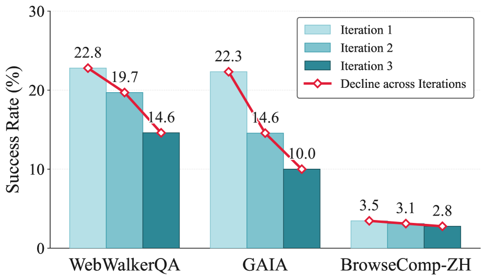

# Rethinking Continual Experience Internalization for Self-Evolving LLM Agents

> **TL;DR**: The paper investigates why existing experience internalization methods fail under multi-iteration self-evolution for LLM agents, identifying three key dimensions: experience granularity, injection pattern, and internalization regime. It shows that principle-level experience, step-wise injection, and off-policy context-distillation together provide a stable recipe for sustained improvement across iterations. The findings enable continual experience learning without the performance collapse observed in prior approaches.

| Field | Value |
|-------|-------|
| **Paper** | [arXiv:2606.04703](https://arxiv.org/abs/2606.04703) |
| **HuggingFace** | [Link](https://huggingface.co/papers/2606.04703) |
| **Code** | [GitHub](https://github.com/RUCBM/ExpInternalization) |

| **Published** | 2026-06-03 |
| **Authors** | Jingwen Chen, Wenkai Yang, Shengda Fan, Wenbo Nie, Chenxing Sun, Shaodong Zheng, Yangen Hu, Lu Pan, Ke Zeng, Yankai Lin |
| **Affiliations** | Gaoling School of Artificial Intelligence, Renmin University of China, School of Software, Beihang University, Meituan |
| **Keywords** | Experience Internalization, Continual Learning, LLM Agents, Context Distillation, On-policy Distillation, Off-policy Distillation, Experience Granularity, Step-wise Injection |
| **Paper Type** | Method · Benchmark · Survey · **Analysis** ✅ · Empirical · Framework · Position · Application |

## Experimental Setup

The paper uses three evaluation benchmarks: [WebWalkerQA](https://arxiv.org/abs/2502.19768) (in-domain), [GAIA-Text-103](https://arxiv.org/abs/2311.12983), and [BrowseComp-ZH](https://arxiv.org/search/?query=BrowseComp-ZH&searchtype=all) (out-of-domain). Training data is drawn from five public web-reasoning QA datasets: [WebWalkerQA-silver](https://arxiv.org/abs/2502.19768), [DeepDive](https://scholar.google.com/scholar?q=DeepDive+Lu+2025), [WebShaper](https://scholar.google.com/scholar?q=WebShaper+Tao+2025), [WebDancer](https://scholar.google.com/scholar?q=WebDancer+Wu+2026), and [SailorFog-QA](https://scholar.google.com/scholar?q=SailorFog-QA+Li+2025).

## Previous Work & Limitations

### Key Prior Approaches
- **[In-Context Experience Learning](https://arxiv.org/abs/2302.04761)**: Context-based methods present accumulated experience as inference-time context, including retrieval, reflection, and abstraction techniques, e.g., [Reflexion (Shinn et al., 2023)](https://arxiv.org/abs/2303.11366), [Experience Summarization (Cai et al., 2025)](https://scholar.google.com/scholar?q=Cai+et+al.+2025+experience+summarization), and [MemWalker (Zhang et al., 2025)](https://arxiv.org/search/?query=MemWalker+Zhang+2025). These are bounded by context length and prone to context collapse.
- **[Context Distillation (Snell et al., 2022)](https://arxiv.org/abs/2204.05698)**: Internalizes experience from a teacher into a student model via distribution matching. Early formulations were off-policy ([Hinton et al., 2015](https://arxiv.org/abs/1503.02531)), while recent works shift to on-policy context distillation ([Ye et al., 2026b](https://scholar.google.com/scholar?q=Ye+2026b+on-policy+context+distillation); [Shenfeld et al., 2026](https://scholar.google.com/scholar?q=Shenfeld+2026+on-policy+distillation)) to improve distributional consistency.
- **[Self-Evolving LLM Agents](https://scholar.google.com/scholar?q=self-evolving+LLM+agents)**: Systems that iteratively improve using interaction data and feedback, e.g., policy-level updates ([Huang et al., 2025](https://scholar.google.com/scholar?q=Huang+2025+self-evolving+agent)) and component-level evolution ([Liu et al., 2025](https://scholar.google.com/scholar?q=Liu+2025+self-evolving+agent)). These do not analyze the stability of experience internalization over multiple iterations.

### Limitations & Gaps
- Most prior experience internalization works only evaluate **single-iteration transfer**; they neglect the necessity and stability of iterative experience learning ([Ye et al., 2026b](https://scholar.google.com/scholar?q=Ye+2026b); [Shenfeld et al., 2026](https://scholar.google.com/scholar?q=Shenfeld+2026)).
- Context-based experience methods **accumulate context** and suffer from collapse, preventing continual use ([Zhang et al., 2025](https://arxiv.org/search/?query=MemWalker+Zhang+2025)).
- No systematic analysis exists on how experience **granularity, injection pattern, and distillation regime** affect multi-iteration learning. This paper addresses these gaps.

## Core Analysis & Insights

*Figure 1: Performance degradation under iterative on-policy context-distillation.*

*Figure 2: 
Effect of Experience Granularity on Qwen3-4B-Instruct-2507 under iterative on-policy context-distillation.
Dashed lines denote base and in-context performance.*

*Figure 3: 
Effect of Experience Injection Pattern on Qwen3-4B-Instruct-2507 under iterative on-policy context-distillation.
Dashed lines denote base performance.*

*Figure 4: 
Case study of premature answering under global injection.
After iterative training, the model trained with global injection terminates without invoking search tools, whereas step-wise injection preserves evidence-seeking tool use before answering.*

*Figure 5: 
Effect of Internalization Regime across self-evolution iterations.
We compare off-policy context-distillation with on-policy context-distillation under principle-level experience and step-wise injection on Qwen3-4B-Instruct-2507 and Qwen3-8B.
Dashed lines denote the base model without experience internalization.*

*Figure 7: 
Experience internalization and in-context experience use under DeepSeek-generated principle-level experience and off-policy context-distillation.
Top panels use global injection, and bottom panels use step-wise injection.
Cyan bars denote internalized inference without inference-time experience, while red bars denote performance with the corresponding experience pool provided in context.*

*Figure 8: 
Experience internalization and in-context experience use under global injection with principle-level self-generated experience and off-policy context-distillation.
Cyan bars denote internalized inference without inference-time experience, while red bars denote performance with the corresponding experience pool provided in context.*

### Continual Experience Internalization Framework
The paper formalizes iterative experience internalization. At iteration `$k$`, agent policy `$\pi_{\theta^{(k)}}$` interacts with the environment (ReAct-style [Yao et al., 2022](https://arxiv.org/abs/2210.03629)), generating trajectories `$\mathcal{D}^{(k)}$`, from which an experience pool `$\mathcal{E}^{(k)}$` is extracted. The same policy, conditioned on `$\mathcal{E}^{(k)}$`, serves as the teacher to distill into the next experience-free student `$\pi_{\theta^{(k+1)}}$`.
Two internalization regimes are defined:
- **Off-policy context-distillation**: `$\mathcal{L}_{\mathrm{off}} = \mathbb{E}_{\mathcal{H}\sim\pi_T}\sum_t D_{\mathrm{KL}}(p_t \| q_t)$`
- **On-policy context-distillation**: `$\mathcal{L}_{\mathrm{on}} = \mathbb{E}_{\mathcal{H}\sim\pi_\theta}\sum_t D_{\mathrm{KL}}(q_t \| p_t)$`
where `$p_t$` is teacher distribution with experience and `$q_t$` is student distribution.

### Analyzed Dimensions
1. **Experience Granularity**: Compares **instance-level** (trajectory-specific details) vs. **principle-level** experience (abstracted reusable strategies, failure patterns). Principle-level experience is more durable across iterations.
2. **Experience Injection Pattern**: **Global injection** (`$p_t^{\mathrm{glob}}$` uses fixed experience context for whole trajectory) vs. **step-wise injection** (`$p_t^{\mathrm{step}}$` selects relevant experience at each step via a selector `$R_\phi$`). Step-wise injection aligns experience with intermediate decision states, preserving experience-use ability.
3. **Internalization Regime**: **On-policy** (student-generated trajectories, teacher corrects flawed states) vs. **off-policy** (teacher-generated trajectories, filtered by rejection sampling). Off-policy provides more coherent, proactive supervision.

### Combined Recipe
A stable multi-iteration recipe integrates principle-level experience, step-wise injection, and off-policy context-distillation. Implementation uses [DeepSeek-V4](https://arxiv.org/search/?query=DeepSeek-V4&searchtype=all) for experience extraction/selection (or self-generated by student model), and the [verl](https://github.com/volcengine/verl) training framework. Models: [Qwen3-4B-Instruct-2507](https://arxiv.org/abs/2505.19514) and [Qwen3-8B](https://arxiv.org/abs/2505.19514).

## Evidence & Validation

*Figure 6: 
Self-evolution performance of Qwen3-4B-Instruct-2507 under our final setting.
Cyan bars denote internalized inference without inference-time experience, while red bars denote in-context experience use with the corresponding experience pool.
The results show that our setting sustains performance gains across self-evolution iterations and preserves the model’s ability to benefit from explicit experience.*

### Experimental Setup
Training on 15K examples from five web-reasoning datasets, evaluation on [WebWalkerQA](https://arxiv.org/abs/2502.19768), [GAIA-Text-103](https://arxiv.org/abs/2311.12983), and [BrowseComp-ZH](https://arxiv.org/search/?query=BrowseComp-ZH&searchtype=all). Metrics: Pass@1 (WebWalkerQA, BrowseComp-ZH) and average accuracy (GAIA). Models: Qwen3-4B-Instruct-2507 and Qwen3-8B.

### Single-Iteration Results
- **Granularity**: Principle-level experience outperforms instance-level (e.g., WebWalkerQA: ~31% vs. ~25% for Qwen3-4B after iteration 1).
- **Injection Pattern**: Step-wise injection consistently beats global injection. For Qwen3-4B with self-generated experience, step-wise improves WebWalkerQA from 23.2% to 31.2% in Iteration 1.
- **Regime**: Off-policy context distillation yields shorter trajectories (average assistant turns 4.5 vs. 21.9 for on-policy) and stronger single-round gains.

### Multi-Iteration Self-Evolution
- **Granularity**: Instance-level experience leads to rapid performance collapse; principle-level maintains improvement over 3 iterations.
- **Injection Pattern**: Global injection degrades performance across iterations; step-wise injection sustains gains (e.g., Qwen3-4B on WebWalkerQA: step-wise remains above 30% through iteration 3, global drops below base model). Step-wise also preserves in-context experience-use ability.
- **Regime**: On-policy internalization shows trajectory inflation and instability; off-policy with rejection sampling maintains stability.
- **Combined Recipe**: Principle-level + step-wise + off-policy yields robust iterative improvement (e.g., Qwen3-8B on GAIA: from 28.1% base to 35.0% iteration 2) without collapse.

### Key Quantitative Highlights
- Premature answer failure: global injection leads to 63.82% `\<answer\>` without tool calls; step-wise injection shows 0%.
- Trajectory efficiency: off-policy distillation uses 4.5 assistant turns vs. 21.9 for on-policy distillation after one update.
- Full self-evolution table (Appendix D) confirms step-wise + off-policy combination beats all other setups across three benchmarks.

## Critical Analysis

The paper provides a systematic empirical analysis of how experience granularity, injection pattern, and internalization regime affect the stability of multi‑iteration experience internalization for LLM agents. The insights are valuable and clearly communicated, but the experimental validation is limited to two small models on a narrow set of web‑reasoning tasks, lacks statistical significance testing, and relies heavily on an external strong teacher model. The number of iterations is small, and several confounding factors are not isolated. These weaknesses reduce the strength and generalizability of the conclusions.

- **[HIGH]** The experiments use only two small models ([Qwen3‑4B‑Instruct‑2507](https://arxiv.org/abs/2505.19514) and [Qwen3‑8B](https://arxiv.org/abs/2505.19514)). There is no evidence that the findings translate to larger models (e.g., 70B, 405B) or fundamentally different architectures, making the claim of “concrete guidance for engineering self‑evolving and continually learning LLMs” over‑broad.

- **[HIGH]** No statistical significance tests or confidence intervals are reported for the performance metrics. Pass@1 on [WebWalkerQA](https://arxiv.org/abs/2502.19768) and [BrowseComp‑ZH](https://arxiv.org/search/?query=BrowseComp-ZH&searchtype=all) is estimated from a single rollout per query, and [GAIA‑Text‑103](https://arxiv.org/abs/2311.12983) uses only three rollouts. Observed differences could be noise, especially given the small dataset sizes, yet the paper draws strong comparative conclusions.

- **[HIGH]** The off‑policy vs. on‑policy comparison confounds multiple factors: trajectory source (teacher‑generated vs. student‑generated), loss type (forward KL vs. reverse KL), and the use of rejection sampling. It is not established whether the claimed advantage of off‑policy distillation comes from more coherent supervision, the trajectory distribution, or the filtered positive examples. A cleaner ablation would be needed for a causal claim.

- **[MEDIUM]** The recipe heavily depends on an external strong model ([DeepSeek‑V4](https://arxiv.org/search/?query=DeepSeek-V4&searchtype=all)) for experience extraction and step‑wise selection. When the student model itself must generate and select experience (the Qwen self‑generated setting), performance is noticeably lower, raising doubts about the practicality of the recipe in fully self‑evolving loops where no oracle‑quality teacher is available.

- **[MEDIUM]** The self‑evolution experiments run only three iterations. There is no evidence that the combined recipe remains stable beyond this horizon. The term “sustainable” is used repeatedly but is not tested with a longer sequence of updates, which limits the strength of the claims about continual learning.

- **[MEDIUM]** The analysis is confined to a single agent domain (web reasoning) and five training datasets. The conclusions may not carry over to other agent tasks (code generation, dialogue, robotics) or different interaction paradigms, yet the abstract and introduction frame the findings as general for LLM agents.

- **[MEDIUM]** The paper lacks baseline comparisons to simple behavioral cloning (supervised fine‑tuning on successful teacher trajectories without distillation) or other continual learning techniques (e.g., experience replay, regularization). This makes it unclear whether the complications of distillation are necessary or whether simpler methods would show similar iterative stability.

- **[MEDIUM]** The step‑wise injection selector $R_\phi$ is described as an LLM‑based module, but no details are given on its design, training, or whether it is updated across iterations. This hurts reproducibility and makes it difficult to assess whether the selector quality degrades during self‑evolution.

- **[LOW]** Off‑policy digestion uses rejection sampling to retain only successful trajectories. While this improves stability, it may bias the experience pool toward a narrow set of behaviors and reduce exploration variety over iterations. The paper does not discuss this potential long‑term cost.

- **[LOW]** The analysis of experience granularity uses LLM‑generated summaries, but no human evaluation is conducted to verify the actual quality or correctness of the abstracted principle‑level experience. The statistics about content ratios (e.g., 74.4% contain URLs) appear to be based on automatic checks, which may not fully capture semantic differences.

## Related Papers

No related papers found.

## Generation Cost

- **Model**: `deepseek-v4-pro` (DeepSeek) — 30867 tokens ($0.017938)

- **Model**: `doubao-seed-2-0-lite-260215` (ByteDance-Seed) — 0 tokens ($0.000000)

- **Total Report Generation Cost**: **$0.017938**

---
*Generated by ppagent on 2026-06-24 18:49 using deepseek-v4-pro*